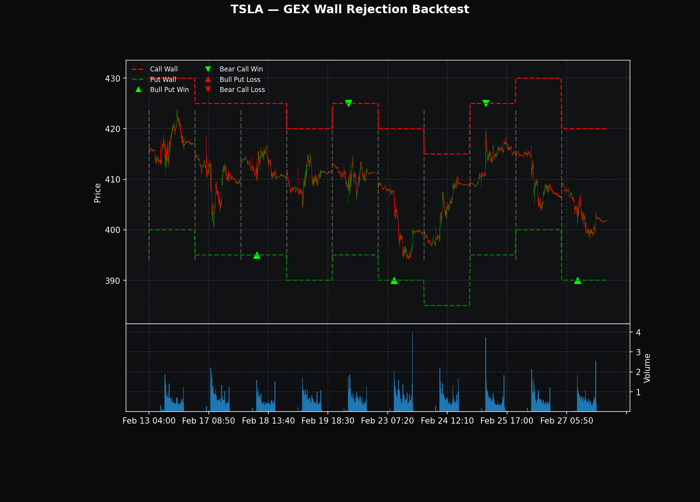
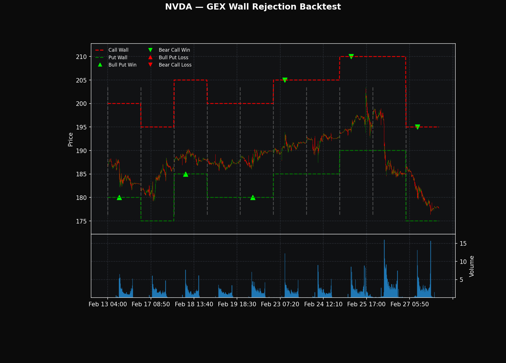
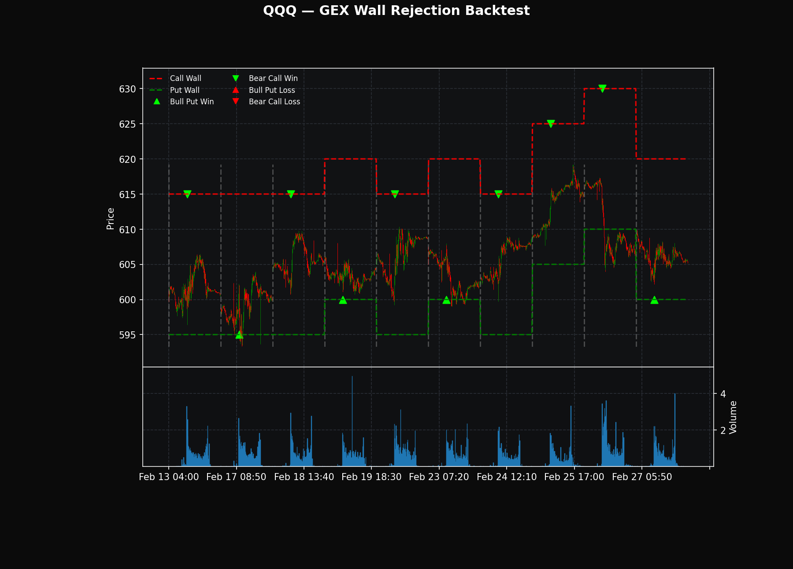
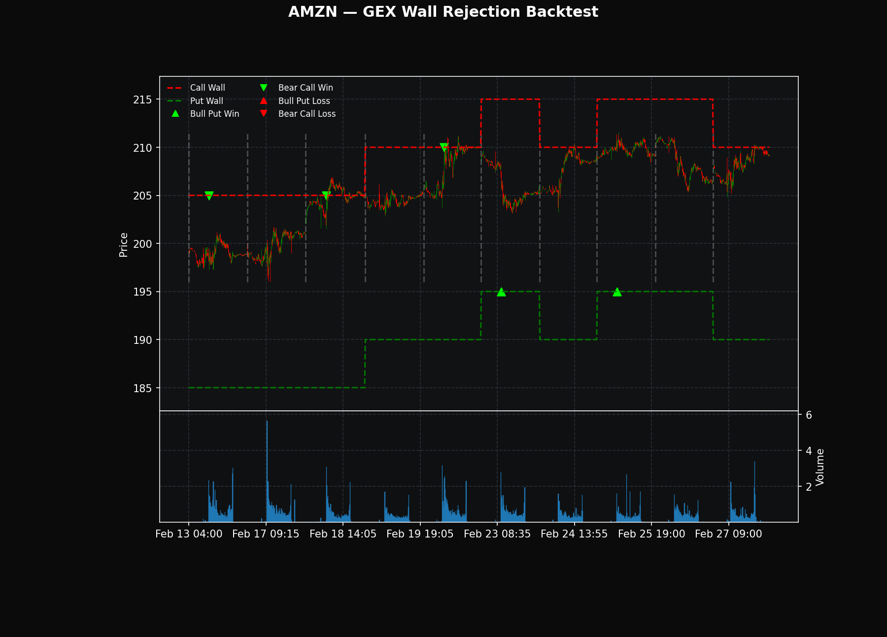
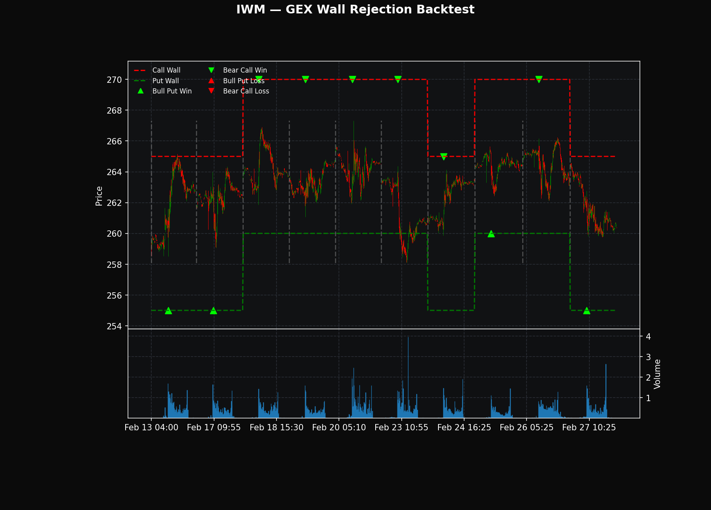
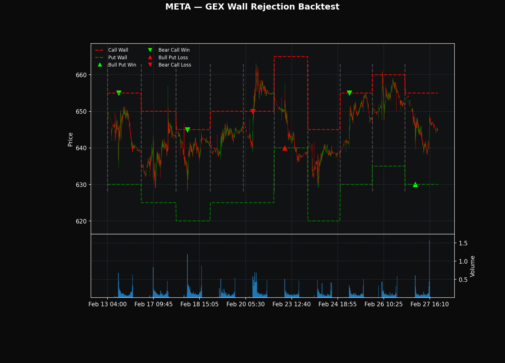
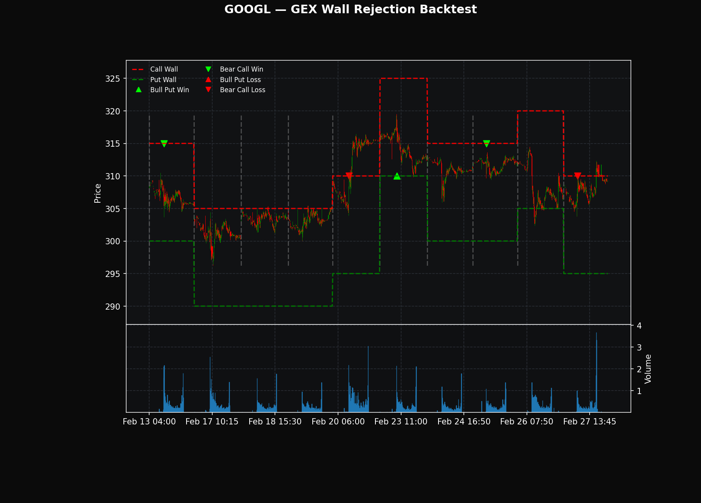

# GEX Wall Rejection 0DTE Credit Spread Backtest

Momentum-triggered 0DTE credit spread strategy that sells premium at **Gamma Exposure (GEX) walls** when intraday momentum spikes exhaust themselves. Uses real option prices from the Polygon API for accurate P&L.

## Quick Start (Windows)

1. **Install Python 3.12+** from [python.org](https://www.python.org/downloads/) -- check **"Add Python to PATH"** during install
2. Clone this repo and set up a virtual environment:
```
git clone https://github.com/sujoypaulhome/0dte-gex-backtest.git
cd 0dte-gex-backtest
python -m venv venv
venv\Scripts\activate
pip install -r requirements.txt
```
3. Set your Polygon API key (get a free one at [polygon.io](https://polygon.io)):
```
set POLYGON_API_KEY=your_key_here
```
4. Run the backtest:
```
python gex_wall_rejection_backtest.py
```
5. Check `backtest_results/` for charts (PNG), trade log (CSV), and summary (JSON)

> **Note:** The script calls the [Polygon.io](https://polygon.io) API. Free-tier accounts are rate-limited to 5 calls/min -- the code has built-in delays to stay within limits. A full run across all 7 tickers takes a few minutes.

## Strategy Overview

```
Rapid UP move   --> CALL_WALL above --> Sell Bear Call Spread (price rejected at resistance)
Rapid DOWN move --> PUT_WALL below  --> Sell Bull Put Spread  (price rejected at support)
No momentum spike --> No trade
```

**Core thesis:** GEX walls act as price magnets and barriers. When a 5-minute candle's range exceeds 2x the 14-period ATR during the first hour (9:35-10:30 ET), the move is overextended. Sell a credit spread at the nearest wall, betting on mean reversion by close.

## How It Works

1. **Fetch live GEX levels** from Polygon option snapshots (highest OI call strike = Call Wall, highest OI put strike = Put Wall)
2. **Estimate historical walls** by projecting the current wall offset (in $5 strike increments) onto each day's open
3. **Detect momentum spikes** on 5-min candles: candle range > 2x ATR(14) during 9:35-10:30 ET
4. **Sell credit spread** at the wall in the direction of the move
5. **Fetch real option prices** from Polygon aggregates for both legs of the spread
6. **Compute P&L** using actual credit received vs intrinsic at close

## Instruments

| Ticker | Type | 0DTE Schedule | Spread Width | Avg Credit |
|--------|------|---------------|-------------|------------|
| QQQ    | ETF  | Mon-Fri       | $2          | $34.40     |
| IWM    | ETF  | Mon-Fri       | $1          | $9.40      |
| TSLA   | Stock | Mon/Wed/Fri  | $5          | $22.60     |
| NVDA   | Stock | Mon/Wed/Fri  | $5          | $62.50     |
| AMZN   | Stock | Mon/Wed/Fri  | $5          | $37.00     |
| META   | Stock | Mon/Wed/Fri  | $5          | $54.17     |
| GOOGL  | Stock | Mon/Wed/Fri  | $5          | $60.60     |

Tue/Thu are automatically skipped for individual stocks (no 0DTE available).

## Sample Results (Feb 13-27, 2026)

```
Total trading days:   50
Total trades:         47
Wins / Losses:        43 / 4
Win rate:             91.5%
Total P&L:            $+279.00
Profit factor:        1.26
Real option prices:   40 of 47 trades (85%)
```

## Backtest Charts

Each chart shows 5-minute candlesticks over the 10-day lookback period with:
- **Red dashed line** -- Call Wall (resistance, shifts daily based on open)
- **Green dashed line** -- Put Wall (support, shifts daily based on open)
- **Green down-arrow** -- Bear call spread sold at call wall (WIN)
- **Green up-arrow** -- Bull put spread sold at put wall (WIN)
- **Red down-arrow** -- Bear call spread sold at call wall (LOSS)
- **Red up-arrow** -- Bull put spread sold at put wall (LOSS)
- **Gray dashed verticals** -- Session separators (day boundaries)

---

### TSLA -- 5/5 wins, +$113, 100% real prices

TSLA's high implied volatility produces the fattest premiums among the single-stock names. Walls at $390 (put) and $425 (call) held cleanly across all 5 MWF trading days. The Feb 25 bear call spread collected $66 in credit -- the best single-trade credit in the backtest.



---

### NVDA -- 6/6 wins, +$375, highest total P&L

NVDA dominated on total P&L despite only 6 trades. The wide put wall placement ($180-185) caught multiple bull put spreads that collected $32-40 in real premium. Two bear call trades on Feb 23 and Feb 25 used estimated pricing ($150 each) because the call walls were so far OTM that Polygon had no 5-min option bar data.



---

### QQQ -- 10/10 wins, +$344, daily 0DTE

QQQ traded every day as a daily-0DTE ETF. Put wall spreads at $595-600 collected the best real premiums ($43-55), while call wall spreads further OTM at $615-630 collected only $1-3. Three call-side trades fell back to estimated pricing. The chart clearly shows price bouncing between the wall channels.



---

### AMZN -- 5/5 wins, +$174, all real prices

Every AMZN trade used real option data. The Feb 18 bear call at the $205 wall collected $90 in credit (short leg at $1.00, long at $0.10) and expired with AMZN closing at $204.79 -- just $0.21 below the wall. The Feb 20 trade was a partial winner: price closed at $210.11 (barely ITM on the $210 wall) but the $87 credit absorbed the $11 intrinsic for a net +$76.



---

### IWM -- 10/10 wins, +$94, lowest credits

IWM is a low-IV ETF so credits are small ($1-12 per trade). Daily 0DTE means maximum trade count (10 trades in 10 days). 8 of 10 trades used real prices. The strategy works here but the $9.40 average credit barely justifies commissions in live trading.



---

### META -- 4/6 wins, -$450, walls breached twice

META is the cautionary tale. It collects fat premiums (avg $54.17) but the GEX walls are only $5-10 from spot. On Feb 20, the bear call at $650 was blown through -- price closed at $655.66 for a -$361 max loss. On Feb 23, a bull put at $640 saw price dip to $637.25 for a -$258 loss. Two losses wiped out four wins. The chart shows the red loss markers right at the wall levels where price pushed through.



---

### GOOGL -- 3/5 wins, -$371, similar wall-breach problem

GOOGL shows the same pattern as META: high credits ($60.60 avg) but tight walls that get breached. The Feb 20 bear call at $310 saw price close at $314.98 for a -$374 max loss. The Feb 27 bear call at $310 also lost $89. These losses more than offset the three wins. The red down-arrows on the chart sit right at the wall level where price continued through.



---

## Key Findings

**What works:**
- ETFs with daily 0DTE (QQQ, IWM) generate the most trades and highest win rates
- TSLA/NVDA/AMZN: high IV + walls far enough from spot = consistent profits
- Real option pricing reveals that SPY call spreads collect pennies ($0.02-0.03/share) -- SPY was removed from the strategy for this reason

**What doesn't work:**
- META/GOOGL: walls are too close to spot ($5 away). When breached, max loss ($500) dwarfs the credit collected
- Estimated pricing inflates P&L unrealistically -- always prefer real prices

**Open questions:**
- Would wider walls (2-3 increments minimum) fix META/GOOGL?
- Is 10 days enough data to draw conclusions? (No -- this is a proof of concept, not a production signal)
- How do commissions and slippage affect the $1-3 credit ETF trades?

## Files

| File | Description |
|------|-------------|
| `gex_wall_rejection_backtest.py` | Backtest engine -- fetches data, detects signals, simulates trades, generates charts |
| `backtest_results/` | Output directory with per-ticker PNGs, trade_log.csv, and summary.json |
| `requirements.txt` | Python dependencies |
